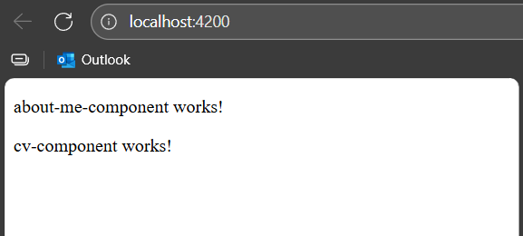

# Instructions
> Now we want to add some fancy content to our project, therefore we can use the Angular CLI which will generate the boilerplate for us 

## Angular CLI

### Generate `components`
We will generate the components for our portfolio application
```
ng generate component components/about-me-component
ng generate component components/cv-me-component
```
this will generate following directories
```
src/app
    └───components
        ├───about-me-component
        └───cv-component
```
each directory wil have the following files:
- `.css` -> cascading style sheet - its to style our component
- `.html` -> hyper text markup language - its to structure our component
- `.ts` -> typescript - its there to add some logic / functionalities
- `.spec.ts` -> it the test for the component (ignore for now)
#### Check if `components` are working
Replace the `src/app/app.html` content with this:
```
<router-outlet />
<app-about-me-component></app-about-me-component>
<app-cv-component></app-cv-component>
```
Add the two components to the `imports` in `src/app/app.ts`:
```
imports: [
    RouterOutlet, 
    AboutMeComponent, 
    CvComponent
],
```
Then run `ng serve` and open your browser on [http://localhost:4200](http://localhost:4200)


### Generate `models`
We will generate the model classes for our portfolio application
```
ng generate class models/about-me
ng generate class models/cv
```
this will generate following files:
```
src/app
    └───models
        ├───about-me.spec.ts
        ├───about-me.ts
        ├───cv.spec.ts
        └───cv.ts
```
- `.ts` -> typescript - here we will define the class / type of our model
- `.spec.ts` -> it the test for the model (ignore for now)

### Generate `services`
We will generate the services for our portfolio application
```
ng generate service selvices/about-me-service
ng generate class models/cv-service
```
this will generate following files:
```
src/app
    └───services
        ├───about-me-service.spec.ts
        ├───about-me-service.ts
        ├───cv-service.spec.ts
        └───cv-service.ts
```
- `.ts` -> typescript - here we will define service functions
- `.spec.ts` -> it the test for the model (ignore for now)