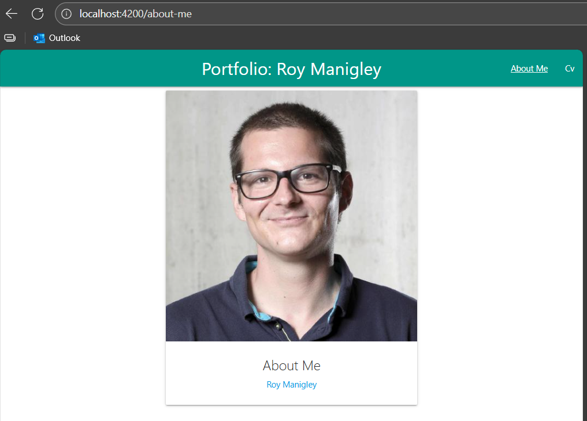

# Instructions

> Now our app has all the content we want but it doesnt look very fancy, so lets spice it up by using paterialise css using CDN

## Add materialisecss to your application

add the `css`, `script` and `fonts` to `src/index.html` according to [materializecss.com/getting-started.html](https://materializecss.com/getting-started.html)

```html
<!doctype html>
<html lang="en">
<head>
  ...
  <!--Import Google Icon Font-->
  <link href="https://fonts.googleapis.com/icon?family=Material+Icons" rel="stylesheet">    
  <!-- Compiled and minified CSS -->
  <link rel="stylesheet" href="https://cdnjs.cloudflare.com/ajax/libs/materialize/1.0.0/css/materialize.min.css">
</head>
<body>
  <app-root></app-root>
  <!-- Compiled and minified JavaScript -->
  <script src="https://cdnjs.cloudflare.com/ajax/libs/materialize/1.0.0/js/materialize.min.js"></script>
</body>
</html>
```

## Be creative
> use some of the [components](https://materializecss.com/badges.html) to make your app look fancy

## Exmple


