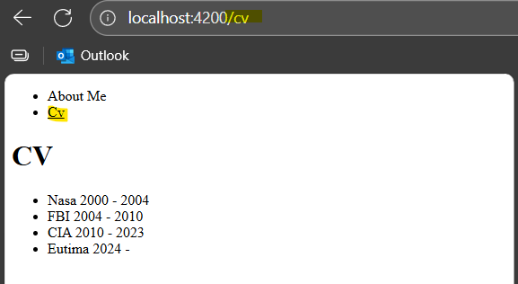

# Instructions

> Our goal is that we have dedicated routes to each of our component:
> `/about-me` will redirect to the `AboutMeComponent`
> `/cv` will redirect to the `CvComponent`

## Define the routing

### Adapt `src/app/app.hmtl`
delete all the components and only keep the `<router-outlet />`

### Adapt `src/app/app.ts`
remove the `imports` for the removed components

### Define the routes in `src/app/app.routes.ts`
```ts
import { Routes } from '@angular/router';
import { AboutMeComponent } from './components/about-me-component/about-me-component';
import { CvComponent } from './components/cv-component/cv-component';

export const routes: Routes = [
    {path: 'about-me', component: AboutMeComponent},
    {path: 'cv', component: CvComponent},
    /* fallback, when no route matches it will redirect to '/about-me' */
    {path: '**', redirectTo: '/about-me'} 
];
```

### Add links to the page
in `src/app/app.ts` add the `RouterModule` to the `imports`
```ts
@Component({
  ...
  imports: [..., RouterModule],
  ...
})
```
`src/app/app.hmtl`
```html
<ul>
    <li [routerLink]="['/about-me']" routerLinkActive="active">About Me</li>
    <li [routerLink]="['/cv']" routerLinkActive="active">Cv</li>
</ul>
<router-outlet />
```
`src/app/app.css`
```css
.active {
    text-decoration: underline;
}
```

## Test it
> Now if you run `ng serve` you can test if the routing works by opening your browser and then click on the menu points and observe if the expected component will be rendered


