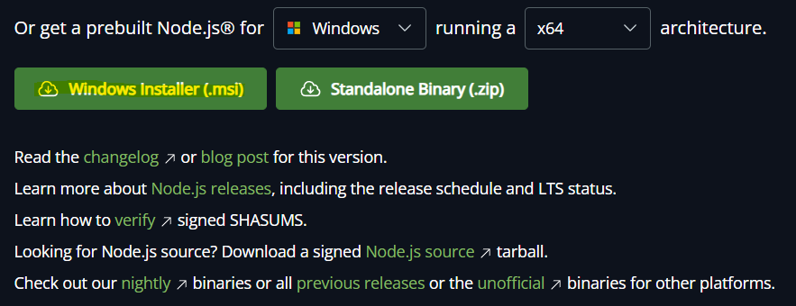
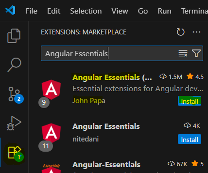

# Instructions

## Toolset Installation

### Node JS
[https://nodejs.org](https://nodejs.org/en/download)


> To check if it was successful run the following commands in your powershell / terminal, if they dont showany error you are good to go.
```
node -v
npm -v
```
### VS Code
[https://code.visualstudio.com](https://code.visualstudio.com/download)
> after you installed VSCode you can install the Angular Essentials plugin by John Papa  


> and enable Autosave under `File -> Autosave`

### Git
[https://git-scm.com](https://git-scm.com/downloads)
> To check if it was successful run the following commands in your powershell / terminal, if they dont showany error you are good to go.
```
git -v
```

## Angular Installation

Open your powershell or terminal and run  
```
npm install -g @angular/cli
```
> To check if it was successful run the following commands in your powershell / terminal, if they dont showany error you are good to go.
```
ng --version
```