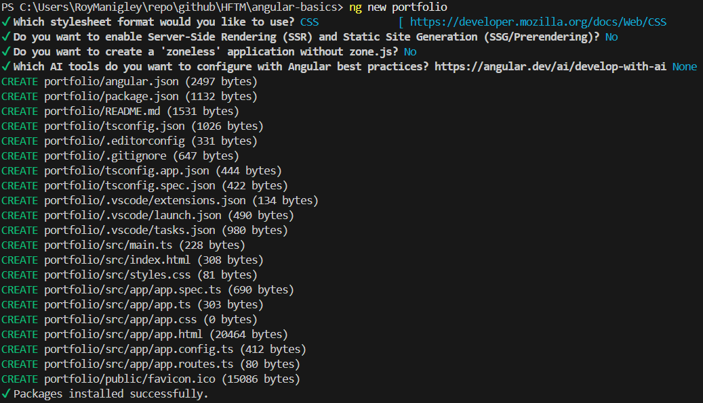
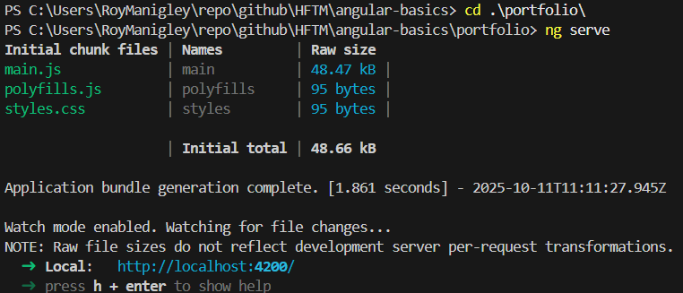
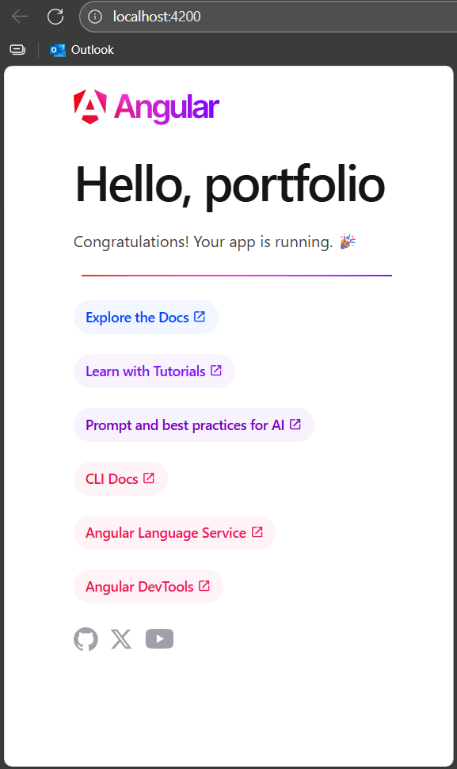

# Instructions
> We are going to generate a simple Protfolio SPA about you or any caracter you want.

## Angular Project

### Initialize your project
> To initialize your project run the following command
```
ng new portfolio
```


### Run your app
> to run your app you will first need to change the directory to `portfolio` and then start the server, therefore you can run those commands  
```
cd portfolio
ng serve
```

### Open your app in the browser
> open your webbrowser and got to [http://localhost:4200](http://localhost:4200)  

